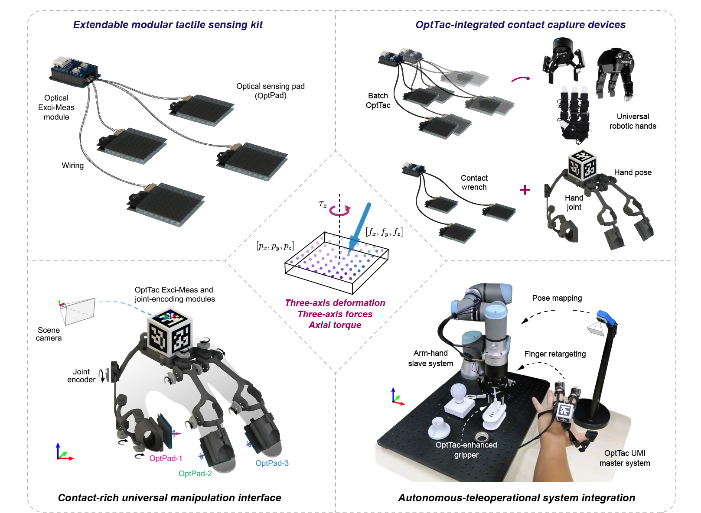

# OptTac: <ins>low-cost</ins>, <ins>triaxial</ins>, <ins>distributed</ins>, <ins>deform-force-torque</ins> tactile sensing kit for generalizeable robotic manipulation

<div align="center">

[](https://wangzivector.github.io/OptTac/)
[](./manicapture/hardware/)
[](./manicapture/)
[](./manicapture/misc)
[](./LICENSE)

</div>

We introduce OptTac, optoelectronic sensing kit enabled triaxial deformation-force-torque generalization for contact-aware manipulation.
The hardware manufacture and software package support are open-sourced for tactile reproduction in supporting relevant manipulation research. [[Project page]](https://wangzivector.github.io/opttac)

<div align="center">
  

<ins>**Features of OptTac**</ins>

| Key characteristics | Functional description | Further reference |
|---------|-------------|-------------|
| ✨ **Open-source** | Hardware fabrication and software solution| Refer to [Project release schedule](#project-release-schedule) |
| 💰 **Low-cost** | Less 10 USD for each OptPad | Refer to [BOM details](#device-manufacture) |
| 🛠 **Reproducible** | Simplified steps with detailed guides | Refer to [Device manufacture](#device-manufacture)  |
| 📐 **Triaxial** | Three-dimensional *deformation* and forces| Refer to [Project page](https://wangzivector.github.io/opttac)  |
| 🕸️ **Distributed**| Locally reconstructed load distribution | Refer to [Project page](https://wangzivector.github.io/opttac)  |
| 💪 **Deform, force, torque** | Both positional and wrench modalities | Refer to [Project page](https://wangzivector.github.io/opttac)  |

</br>

</div>

> The detailed hardware scheme (PCB schemetic, BOM, FPCB Assembly file, and fabricating guides) will be publicly available after preparation and organization, before Nov. 2026.** 


## Project release schedule
<mark>This work is gradually available in scheduled steps, under continuous preparation:</mark>

- [x] Establishment of project page [2026-10-06]
- [ ] Hardware solution for OptTac [Est. 2026-11]
- [ ] Fabrication guidance for OptTac [Est. 2026-10]
- [x] Exoskeleton hand sensing kit: CAD and ROS package [2026-09-29]
- [x] ROS package for tactile computation and visualization [2026-09-29]
- [x] Software setup, usage, and examples [Est. 2026-10-05]
- [x] Pre-trained checkpoints for wrench models [2026-09-29]
- [ ] LeapHand extension using OptTac [Est. 2026-10]
- [ ] LeapHand retargeting using OptTac [Est. 2026-10]

## Device manufacture
### OptPad FPCB manufacture
- EasyEDA project link for PCB schmetic design.
- BOM files
- Assembly service reference

### Elastomer casting
- 3D-printed CAD files of casting molds: [Project pages](page1)
- Manufacture video guidance: [Project pages](page2)

## Software environment
### Step 1: conda env establishment
```
# Create conda environment
conda create -n manicapture python=3.10
conda activate manicapture
```


## License

**This project is licensed under the [PolyForm Noncommercial License 1.0.0](LICENSE).**

Researchers and practitioners are welcome to implement this project by complying the noncommercial license.
You may use, copy, and modify this code for noncommercial purposes, such as academic research, personal study, or experimentation.


## Citation
If you want to cite this work, please find reference below:
```
@article{wang2026opttac,
  title={OptTac: Reproducible optoelectronic tactile sensing of distributed triaxial deformation, force, and torque for robotic manipulation},
  author={Wang, Xianli and Wu, zehao and Xu, Qingsong},
  journal={Unknown},
  year={2026}
}
```